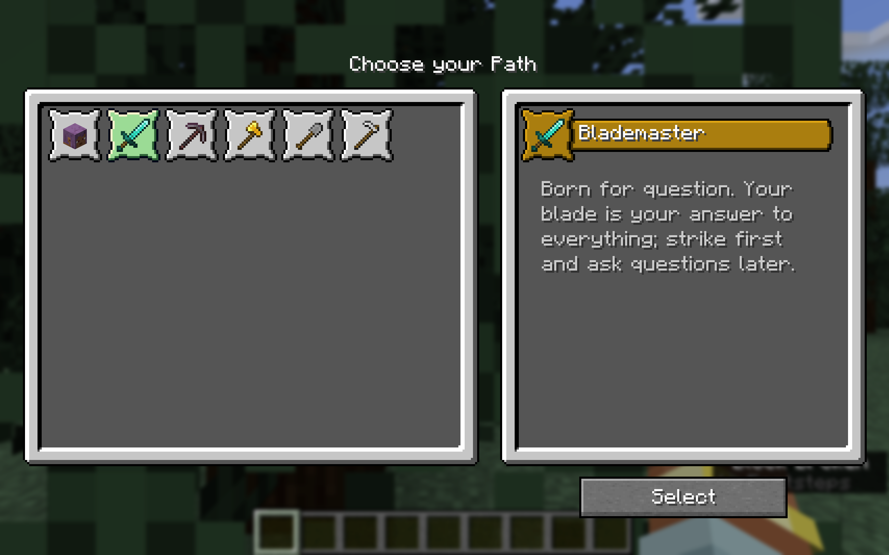
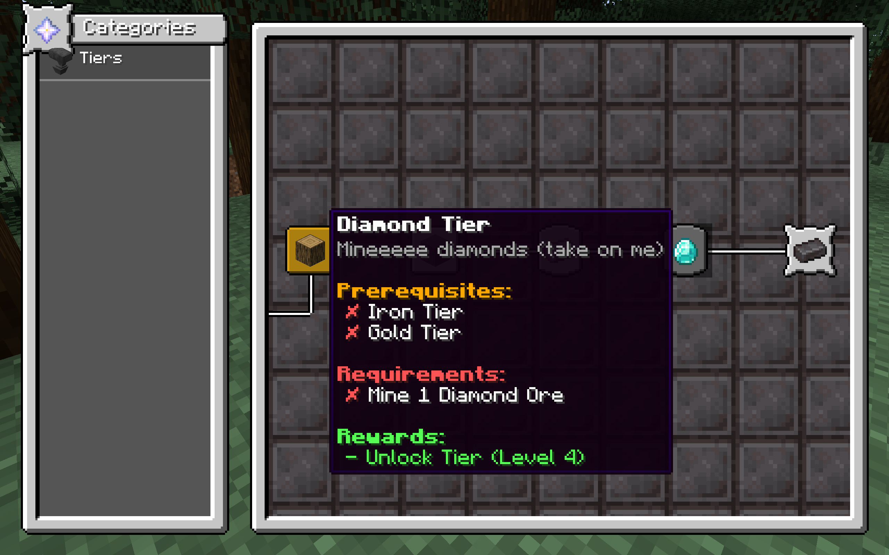
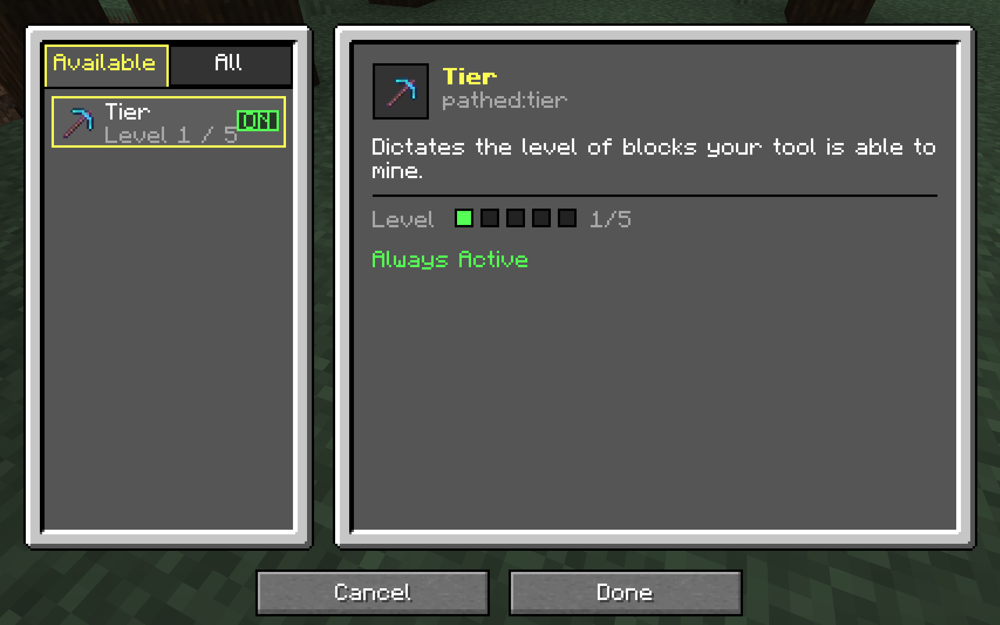

<p align="center"></p>

<h1 align="center">Pathed <br>
    <a href="https://github.com/junyali/pathed/actions/workflows/build.yml"></a>
    <a href="https://github.com/junyali/pathed/releases/"></a>
    <a href="https://github.com/junyali/pathed/blob/main/LICENSE"></a>
    <br>
    <a href="https://ko-fi.com/junyali"></a>
    <br><br>
</h1>

**Quick Disclaimer: this mod is super work-in-progress. As of writing this it is NOT yet complete, though alpha builds are available!**

Pathed is a Minecraft progression mod aimed to add a twist on your vanilla journey. Choose a **path** at the start of your journey and become locked to a single **tool**. That tool becomes your lifeline - it can do everything, but does well with specific asks aligned with your path.

## Gallery

**Select a Path**



**Progress in your journey**



**Master your tool**



## Features
- This mod has 5 unique paths covering different gameplay mechanics (TBA). If you prefer the vanilla experience, the human option is always available!
- You are locked to your tool (TBA). Combat, mining, harvesting - all in one tool no matter your path.
- Attribute System to manage your path's attributes. Unlock more attributes through the progression system.
- Custom progression system (kinda inspired by vanilla Minecraft's advancement system and Payday 2's skill trees)

## How to run / build

### Requirements

**NeoForge:** This mod was built on NeoForge version 21.1.224 for 1.21.1

### Running

Download the latest release [here](https://github.com/junyali/pathed) or from your favourite mod distribution platform (TBA).

### Building

This mod was developed on IntelliJ IDEA Ultimate, though may work with other Java IDEs that support the Gradle Build Tool.
Importing from `build.gradle`, run:

```console
$ ./gradlew
```

Then to launch the client configuration, run:

```console
$ ./gradlew runClient
```

Be sure to sync all gradle projects and refresh dependencies if you encounter issues related to Gradle.

